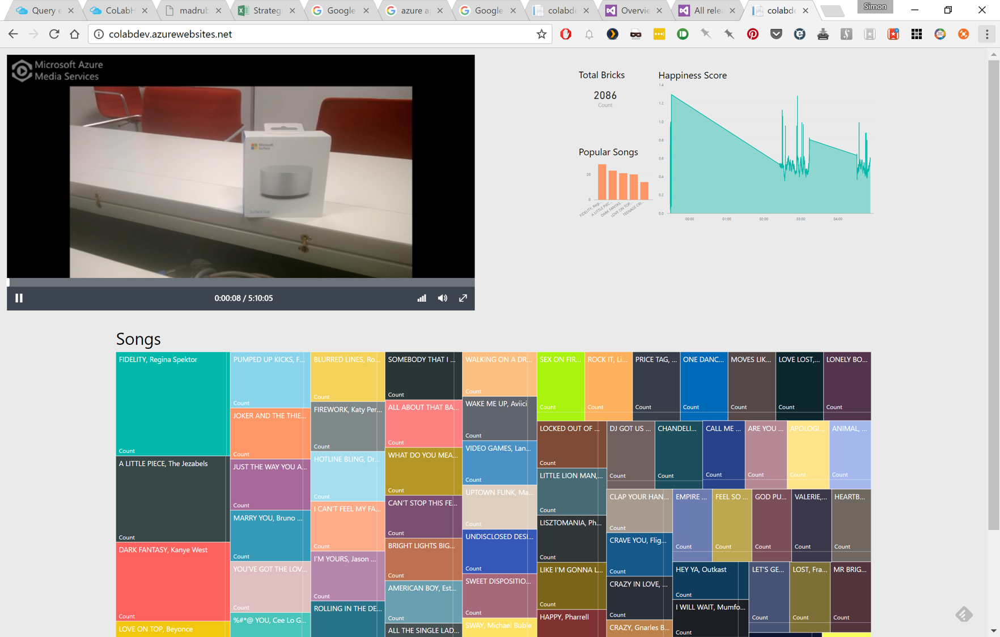

# CoLab Dashboard
Dashboard all of the things...

1. Captured video stream using Azure Media Services.
2. Congitive APIs detected emotions and pushed the results to an Event Hub.
3. Stream Analytics was used to group the data into sliding windows and results were pushed to a Service Bus queue.
4. Data to represent the other team activities (!Tetris, DJ Studio, Lego  Music) was sent to Service Bus queues.
5. Logic Apps processed the four resulting Service Bus queues and inserted the data into relational tables in SQL Azure.
6. Custom Function Apps needed to be written to address some of the weird data inserted by Stream Analytics when posting to the Service Bus queues.
7. The resulting tables were visualised in Power BI Embedded as shown below:

For information on the processing of the data being displayed on the database, refer to the [CoLabPipeline](CoLabPipeline). 
